# Plan Command, Skill, And Template Flowchart

This draft shows the relationship between planning commands, internal skills, planning template documents, generated planning documents, and the shared manifest/state files.

```mermaid
flowchart TD
    %% Entry
    U[User App Idea] --> C_START[Command: plan-start]
    C_START --> S_START[Skill: plan-start-core]

    %% Start template inputs
    T_INDEX[Template: Build-Plan-Template-Index] --> S_START
    T_INTAKE[Template: App-Idea-Intake] --> S_START
    T_DYNAMIC[Template: Dynamic-Build-Plan] --> S_START
    T_TECH[Template: Tech-Stack-Decision] --> S_START
    T_Q1[Template: Stage-1-Dynamic-Questionnaire] --> S_START
    T_Q2[Template: Stage-2-Dynamic-Questionnaire] --> S_START
    T_Q3[Template: Stage-3-Dynamic-Questionnaire] --> S_START
    T_Q4[Template: Stage-4-Dynamic-Questionnaire] --> S_START

    %% Start outputs
    S_START --> D_INTAKE[Doc: App-Idea-Intake.md/json]
    S_START --> D_PRD[Doc: Product-Requirements-Document.md/json]
    S_START --> STATE[Doc: manifest.json + state.json]

    %% Stage 1
    STATE --> C_STAGE1[Command: plan-stage1]
    D_PRD --> C_STAGE1
    C_STAGE1 --> S_STAGE1[Skill: plan-stage1-core]
    T_DYNAMIC --> S_STAGE1
    T_TECH --> S_STAGE1
    T_BUSINESS[Template: Business-Model-And-Pricing] -. optional .-> S_STAGE1
    T_Q1 --> S_STAGE1

    S_STAGE1 --> D_STAGE1[Docs: Stage 1 Planning Artifacts]
    D_STAGE1 --> G_STAGE1[User Review Gate]
    G_STAGE1 --> S_FREEZE1[Skill: plan-freeze-stage1-core]
    S_FREEZE1 --> F_STAGE1[Doc: Stage-1-Freeze-Review.md/json]
    S_FREEZE1 --> STATE

    %% Stage 2
    STATE --> C_STAGE2[Command: plan-stage2]
    C_STAGE2 --> S_STAGE2[Skill: plan-stage2-core]
    T_DYNAMIC --> S_STAGE2
    T_PERSONAS[Template: User-Personas-And-Jobs-To-Be-Done] -. optional .-> S_STAGE2
    T_INTEGRATION[Template: Integration-And-External-Dependency] -. optional .-> S_STAGE2
    T_SECURITY[Template: Security-And-Compliance] -. optional .-> S_STAGE2
    T_Q2 --> S_STAGE2

    S_STAGE2 --> D_STAGE2[Docs: Stage 2 Planning Artifacts]
    D_STAGE2 --> G_STAGE2[User Review Gate]
    G_STAGE2 --> S_FREEZE2[Skill: plan-freeze-stage2-core]
    S_FREEZE2 --> F_STAGE2[Doc: Stage-2-Freeze-Review.md/json]
    S_FREEZE2 --> STATE

    %% Stage 3
    STATE --> C_STAGE3[Command: plan-stage3]
    C_STAGE3 --> S_STAGE3[Skill: plan-stage3-core]
    T_DYNAMIC --> S_STAGE3
    T_FRONTEND[Template: Frontend-Experience-Decision] --> S_STAGE3
    T_COMPONENT[Template: Component-System-Decision] --> S_STAGE3
    T_ANALYTICS[Template: Analytics-And-Success-Metrics] -. optional .-> S_STAGE3
    T_Q3 --> S_STAGE3

    S_STAGE3 --> D_STAGE3[Docs: Stage 3 Planning Artifacts]
    D_STAGE3 --> G_STAGE3[User Review Gate]
    G_STAGE3 --> S_FREEZE3[Skill: plan-freeze-stage3-core]
    S_FREEZE3 --> F_STAGE3[Doc: Stage-3-Freeze-Review.md/json]
    S_FREEZE3 --> STATE

    %% Stage 4
    STATE --> C_STAGE4[Command: plan-stage4]
    C_STAGE4 --> S_STAGE4[Skill: plan-stage4-core]
    T_DYNAMIC --> S_STAGE4
    T_OPERATIONS[Template: Operations-And-Support] -. optional .-> S_STAGE4
    T_RISK[Template: Risk-And-Assumption-Register] -. optional .-> S_STAGE4
    T_Q4 --> S_STAGE4

    S_STAGE4 --> D_STAGE4[Docs: Stage 4 Planning Artifacts]
    D_STAGE4 --> G_STAGE4[User Review Gate]
    G_STAGE4 --> S_FREEZE4[Skill: plan-freeze-stage4-core]
    S_FREEZE4 --> F_STAGE4[Doc: Stage-4-Freeze-Review.md/json]
    S_FREEZE4 --> STATE

    %% Draft all wrapper
    C_DRAFT_ALL[Command: plan-draft-all] --> S_DRAFT_ALL[Skill: plan-draft-all-core]
    S_DRAFT_ALL --> C_STAGE1
    S_DRAFT_ALL --> C_STAGE2
    S_DRAFT_ALL --> C_STAGE3
    S_DRAFT_ALL --> C_STAGE4

    %% Execution planning
    STATE --> C_SLICES[Command: plan-slices]
    C_SLICES --> S_SLICES[Skill: plan-slices-core]
    D_STAGE1 --> S_SLICES
    D_STAGE2 --> S_SLICES
    D_STAGE3 --> S_SLICES
    D_STAGE4 --> S_SLICES
    S_SLICES --> D_SLICES[Docs: Slice Implementation Plans]

    D_SLICES --> C_TASKS[Command: plan-tasks]
    C_TASKS --> S_TASKS[Skill: plan-tasks-core]
    S_TASKS --> D_TASKS[Docs: Task Lists]

    D_TASKS --> C_TICKETS[Command: plan-tickets]
    C_TICKETS --> S_TICKETS[Skill: plan-tickets-core]
    S_TICKETS --> D_TICKETS[Docs: Implementation Tickets]

    %% Inspection and recovery
    STATE --> C_STATUS[Command: plan-status]
    C_STATUS --> S_STATUS[Skill: plan-status-core]
    S_STATUS --> D_STATUS[Doc: status-report.md/json]

    STATE --> C_REOPEN[Command: plan-reopen-stage]
    C_REOPEN --> S_REOPEN[Skill: plan-reopen-stage-core]
    S_REOPEN --> D_REOPEN[Doc: reopen-stage-n-report.md/json]
    S_REOPEN --> STATE
```

## Reading The Flow

- Commands are orchestration entry points.
- Skills are internal workers invoked by commands.
- Planning templates are source documents used by skills.
- Generated docs are command outputs.
- `manifest.json` and `state.json` control progression and validate prerequisites.
- `plan-draft-all` is a wrapper over the four stage commands.
- `plan-status` and `plan-reopen-stage` are side paths for inspection and recovery.
