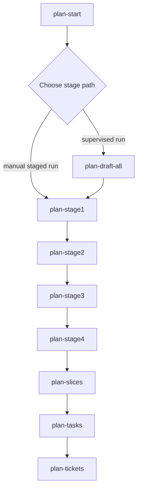
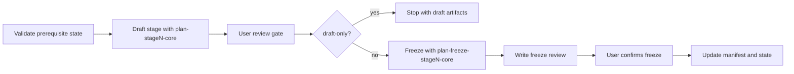
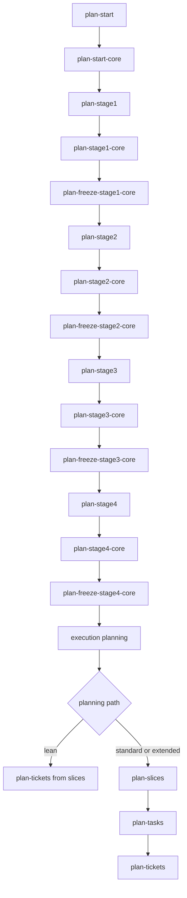

# Plan Command Workflow Review

This review covers the commands in `.opencode/commands` whose names start with `plan-`, with emphasis on the internal planning skills they invoke and where the workflow can be simplified.

## Executive Summary

The current planning flow is mostly coherent:

1. `plan-start` initializes the planning workspace.
2. `plan-stage1` through `plan-stage4` draft and freeze each stage in order.
3. `plan-slices`, `plan-tasks`, and `plan-tickets` convert frozen planning output into execution artifacts.
4. `plan-status` inspects state at any point.
5. `plan-reopen-stage` handles controlled recovery when frozen planning needs revision.

The main inefficiency is not the command order itself. The bigger issue is documentation drift and duplicated responsibility between command contracts, skill files, and draft planning templates.

## Primary Workflow

## Command And Skill Order

| Order | Command | Internal skill order | Preconditions | Main output |
|---:|---|---|---|---|
| 1 | `plan-start` | `plan-start-core` | App idea input | Intake, PRD, manifest, state |
| 2a | `plan-stage1` | `plan-stage1-core` -> user review -> `plan-freeze-stage1-core` | `plan-start` complete | Stage 1 planning artifacts and freeze review |
| 2b | `plan-stage2` | `plan-stage2-core` -> user review -> `plan-freeze-stage2-core` | Stage 1 frozen | Stage 2 planning artifacts and freeze review |
| 2c | `plan-stage3` | `plan-stage3-core` -> user review -> `plan-freeze-stage3-core` | Stage 2 frozen | Stage 3 planning artifacts and freeze review |
| 2d | `plan-stage4` | `plan-stage4-core` -> user review -> `plan-freeze-stage4-core` | Stage 3 frozen | Stage 4 planning artifacts and freeze review |
| 2-alt | `plan-draft-all` | `plan-draft-all-core`, which runs `plan-stage1` -> `plan-stage2` -> `plan-stage3` -> `plan-stage4` | `plan-start` complete | Supervisor report |
| 3 | `plan-slices` | `plan-slices-core` | Stage 4 frozen | Slice implementation index and slice plans |
| 4 | `plan-tasks` | `plan-tasks-core` | Slice plans generated | Task list index and per-slice tasks |
| 5 | `plan-tickets` | `plan-tickets-core` | Task lists generated | Ticket index and per-slice tickets |
| Inspect | `plan-status` | `plan-status-core` | Manifest and state exist | Status report |
| Recover | `plan-reopen-stage` | `plan-reopen-stage-core` | Target stage frozen | Reopen report, downstream invalidation |

## Stage Lifecycle Pattern

The four stage commands all follow the same pattern:

This pattern is useful and should remain. The repeated structure makes the workflow predictable. The best improvement would be to extract the repeated stage lifecycle language into one reusable command contract section and keep each stage command focused on stage-specific inputs and outputs.

## Skill Responsibilities

| Skill | Responsibility | Notes |
|---|---|---|
| `plan-start-core` | Normalizes app idea, activates templates, creates intake, PRD, manifest, and state | Consolidates older suggested intake/classifier/PRD/scaffold skills into one skill |
| `plan-stage1-core` | Drafts MVP scope, tech stack, decision log, dependency gate, architecture, optional business model | Does not freeze |
| `plan-freeze-stage1-core` | Reconciles Stage 1 artifacts and freezes Stage 1 after confirmation | Sequential gate |
| `plan-stage2-core` | Drafts data/domain, state/math, API/job, runtime, optional personas/integration/security | Does not freeze |
| `plan-freeze-stage2-core` | Reconciles Stage 2 artifacts and freezes Stage 2 after confirmation | Sequential gate |
| `plan-stage3-core` | Drafts UX, page architecture, frontend decisions, components, state/history, recovery, lifecycle, optional analytics | Highest frontend planning density |
| `plan-freeze-stage3-core` | Reconciles Stage 3 artifacts and freezes Stage 3 after confirmation | Sequential gate |
| `plan-stage4-core` | Drafts deployment, caching/performance, QA/release, vertical release slice, optional ops/risk | Does not freeze |
| `plan-freeze-stage4-core` | Reconciles Stage 4 artifacts and freezes Stage 4 after confirmation | Unlocks execution planning |
| `plan-draft-all-core` | Supervises Stage 1 through Stage 4 by invoking the stage commands | Should stay thin |
| `plan-slices-core` | Converts frozen planning stack into vertical slice plans | Starts execution planning |
| `plan-tasks-core` | Converts slice plans into per-slice task lists | Middle transformation step |
| `plan-tickets-core` | Converts task lists into execution-ready tickets | Feeds agent execution |
| `plan-status-core` | Reads manifest/state and reports progress, blockers, next commands | Inspection only |
| `plan-reopen-stage-core` | Reopens a frozen stage and invalidates affected downstream stages | Recovery only |

## Optional Template Activation

Optional planning templates are activated early by `plan-start-core`, then consumed later by the appropriate stage skills.

| Optional template | Activation signal | Consuming stage |
|---|---|---|
| `Business-Model-And-Pricing-Template` | Commercial mode | Stage 1 |
| `User-Personas-And-Jobs-To-Be-Done-Template` | User/problem framing is still fuzzy | Stage 2 |
| `Security-And-Compliance-Template` | Sensitive data, files, payments, permissions | Stage 2 and Stage 4 freeze context |
| `Integration-And-External-Dependency-Template` | External APIs or vendors | Stage 2 and Stage 4 freeze context |
| `Analytics-And-Success-Metrics-Template` | Product measurement matters | Stage 3 and slice ordering |
| `Operations-And-Support-Template` | Real user operations/support needed | Stage 4 and slice ordering |
| `Risk-And-Assumption-Register-Template` | Standard or extended path by default | Stage 4 and slice ordering |

## Redundancy And Drift Findings

### 1. `plan-draft-all` overlaps with manual stage commands

This is intentional, not harmful, as long as `plan-draft-all-core` remains a thin supervisor. It should never duplicate Stage 1 through Stage 4 logic. The current skill instructions say it runs `plan-stage1`, `plan-stage2`, `plan-stage3`, and `plan-stage4`, which is the right model.

Recommendation: keep `plan-draft-all`, but label it clearly as an automation wrapper, not a separate planning path.

### 2. Command Contract Draft is stale

`Planning Template/Command-Contract-Draft.md` still lists older skills such as `plan-intake`, `plan-classifier`, `plan-prd`, and `plan-scaffold` for `plan start`. The actual command uses `plan-start-core`.

Recommendation: update the command contract so it reflects the implemented consolidated `*-core` skill model.

### 3. Start command and start skill duplicate long template lists

Both `plan-start.md` and `plan-start-core/skill.md` enumerate many of the same template references and activation rules. This is maintainable now, but it will drift.

Recommendation: make `plan-start.md` reference the skill and the template index at a high level, while `plan-start-core` owns the detailed template activation rules.

### 4. Stage commands repeat the same lifecycle language

`plan-stage1` through `plan-stage4` repeat validate -> draft -> review -> freeze -> confirm -> advance. This is readable but verbose.

Recommendation: preserve the pattern but define a shared "stage command lifecycle" once in the contract draft. Stage command files should then only list stage-specific prerequisites, skills, outputs, and constraints.

### 5. Freeze skills may duplicate validation already done by draft skills

Draft skills validate artifact creation. Freeze skills reconcile and validate readiness. This is a useful separation, but avoid rechecking every low-level file existence rule twice unless the freeze needs it for readiness.

Recommendation: draft skill validates "files were written"; freeze skill validates "the set is internally consistent and safe to lock."

### 6. `plan-slices` -> `plan-tasks` -> `plan-tickets` may be too granular for small projects

For larger apps, this three-step transformation is useful. For very small or lean MVPs, task lists can become a pass-through layer between slices and tickets.

Recommendation: keep all three commands for the standard path, but allow a lean path where `plan-tickets-core` can consume slice plans directly if `plan-tasks` would only restate the slice contents.

### 7. Misspelled output path was corrected

Command, skill, and template outputs now use `Build Plan/Active Plans/Slice Implementation/...`.

Recommendation: if existing generated artifacts are later found under the misspelled path, add a migration note and support both paths temporarily.

### 8. Workspace path shape is inconsistent across documents

Some draft docs recommend `Build Plan/Active Plans/<app-slug>/...`, while current commands write directly under `Build Plan/Active Plans/...`.

Recommendation: choose one canonical shape. For multiple app plans, the slugged shape is safer:

`Build Plan/Active Plans/<app-slug>/...`

For a single active plan, the current flat shape is simpler but less scalable.

## Efficiency Recommendations

1. Keep `plan-start-core` consolidated. Splitting it back into intake/classifier/PRD/scaffold would add orchestration overhead unless those pieces need independent reuse.
2. Keep draft and freeze skills separate. The user confirmation gate is valuable and should not be hidden inside draft generation.
3. Make `plan-draft-all-core` call the existing stage commands only. Do not let it call `plan-stageN-core` and `plan-freeze-stageN-core` directly unless it faithfully reproduces all user gates.
4. Add a shared schema for `manifest.json`, `state.json`, and artifact index entries. Most command validation depends on those files, so schema drift is the biggest reliability risk.
5. Add a `mode` concept to the execution planning phase:
   - `lean`: `plan-slices` -> `plan-tickets`
   - `standard`: `plan-slices` -> `plan-tasks` -> `plan-tickets`
   - `extended`: standard path plus stronger status reports and review gates
6. Use `plan-status` as the visible checkpoint after every major command, but avoid requiring it as a blocking command. It should inspect state, not mutate core progression.
7. Remove `.DS_Store` from `.opencode/commands` and add it to `.gitignore` if not already ignored.

## Recommended Canonical Flow

## Commands That Are Not Redundant

| Command | Keep? | Reason |
|---|---:|---|
| `plan-start` | Yes | Single entry point for app idea normalization and workspace setup |
| `plan-stage1` through `plan-stage4` | Yes | Clear stage gates and bounded ownership |
| `plan-draft-all` | Yes | Useful supervised convenience wrapper |
| `plan-status` | Yes | Needed for visibility and debugging |
| `plan-reopen-stage` | Yes | Needed for controlled recovery |
| `plan-slices` | Yes | Creates implementation ordering from frozen planning |
| `plan-tickets` | Yes | Needed to feed agent execution |

## Commands That May Be Conditionally Redundant

| Command | Redundancy risk | Suggested handling |
|---|---|---|
| `plan-tasks` | Can become a restatement of slices for small projects | Make optional for `lean` planning path |
| `plan-draft-all` | Redundant if user always runs stages manually | Keep as wrapper only |

## Cleanup Checklist

- [ ] Update `Planning Template/Command-Contract-Draft.md` to match the current `*-core` skill names.
- [ ] Decide whether active plan outputs should include `<app-slug>` in the path.
- [x] Correct slice implementation output path spelling.
- [ ] Extract shared stage lifecycle language into one contract section.
- [ ] Define JSON schemas for `manifest.json`, `state.json`, stage artifacts, slices, tasks, and tickets.
- [ ] Add lean-path behavior for skipping `plan-tasks` when it adds no value.
- [ ] Remove `.opencode/commands/.DS_Store` and ignore `.DS_Store` files.
