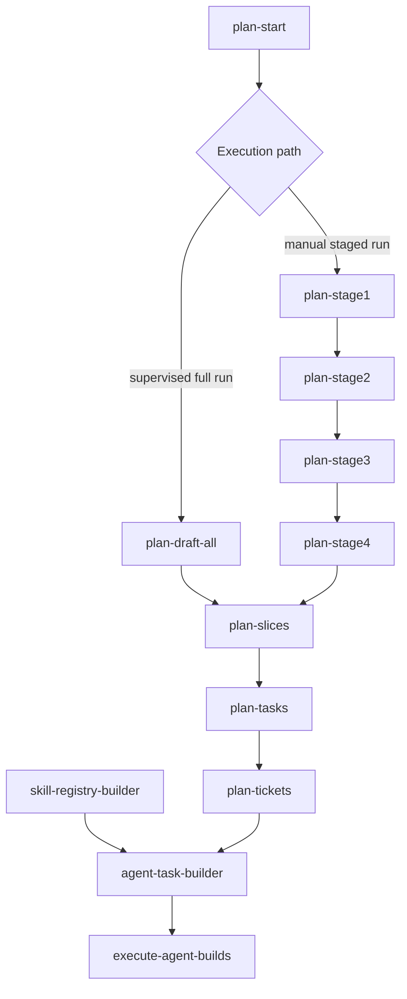
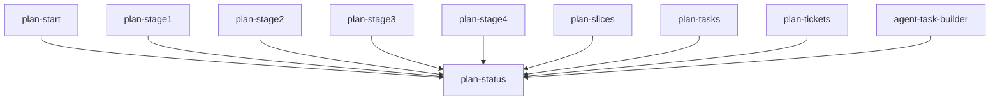
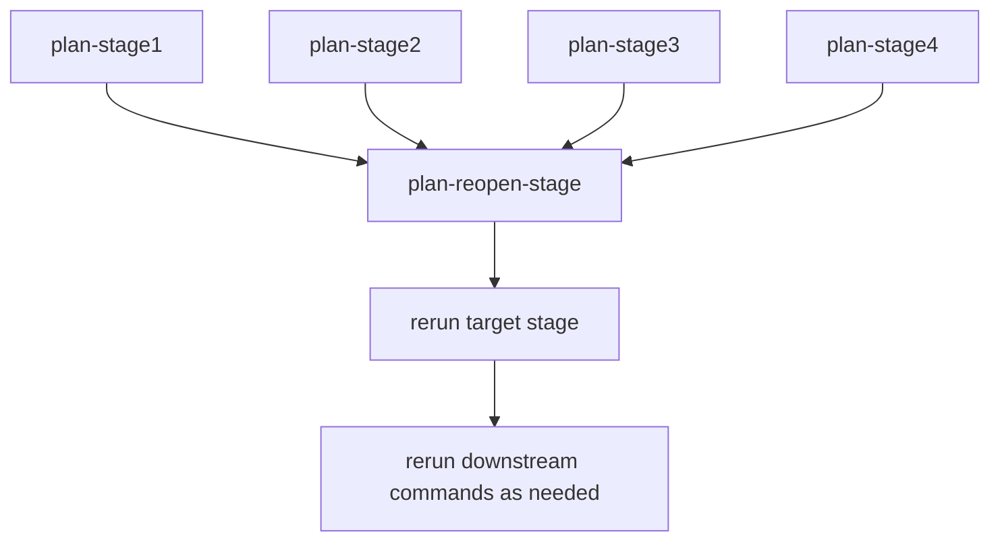

# Command Activation Graph Draft

This draft shows the activation order for the planning and execution commands.

## Primary Flow

## Inspection Path

## Reopen Path

## Notes

- `plan-start` is the entry point.
- `plan-draft-all` is an alternate supervisor path for Stages 1 through 4.
- `plan-slices` starts only after Stage 4 is complete.
- `plan-tickets` feeds `agent-task-builder`.
- `skill-registry-builder` is a prerequisite input provider for `agent-task-builder`.
- `execute-agent-builds` runs only after agent build artifacts exist.
